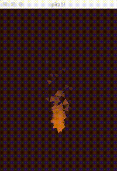
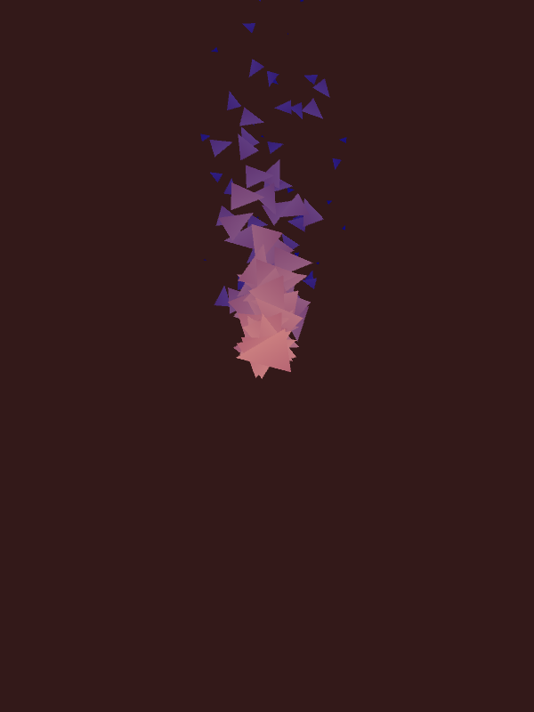

## Pira 🔥

Small experimental library using opengl and rust.

### Examples:

to build one of the examples run:
`cargo run --example {name}`

to run all the examples as test and save an image run:
`cargo test --examples -- --test-threads=1`

#### Instancing:

#### textured quad:

#### Particles:

#### Todo's
1. create buffer objects other with data types different then f32's, use a Vec and enums to specify default attribs, like position and color
2. more shader modes.. 
3. use multiple vbo's on vao, instead of one big large buffer ( relates to #1 )
