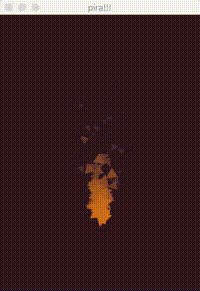
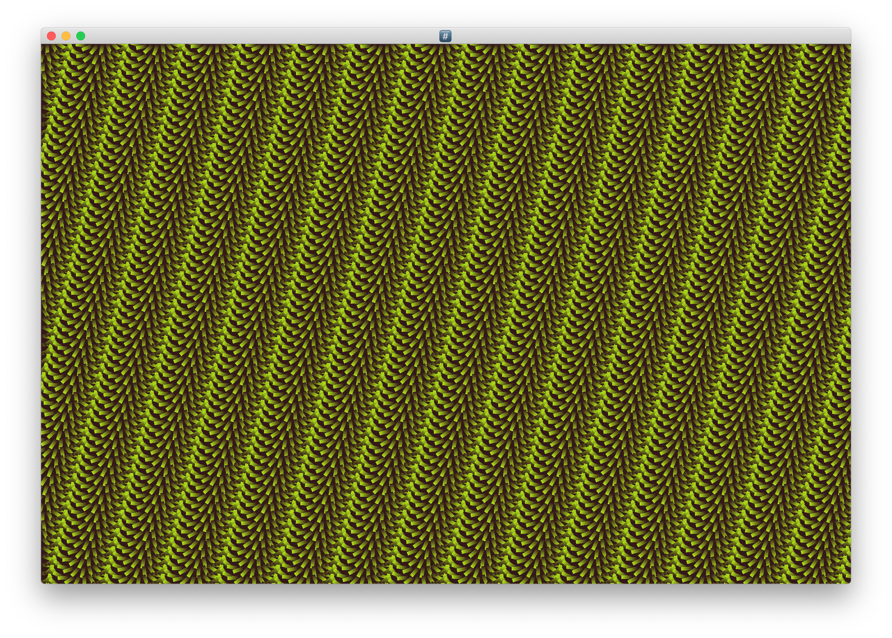
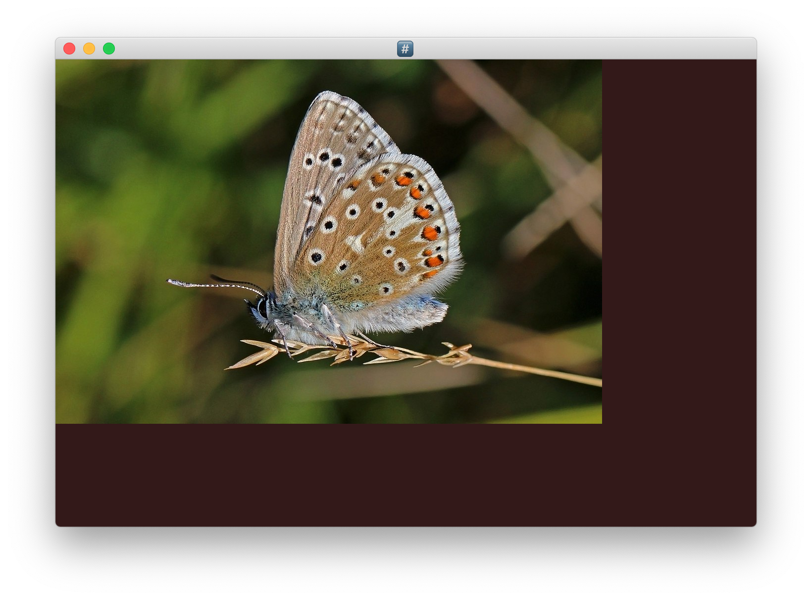
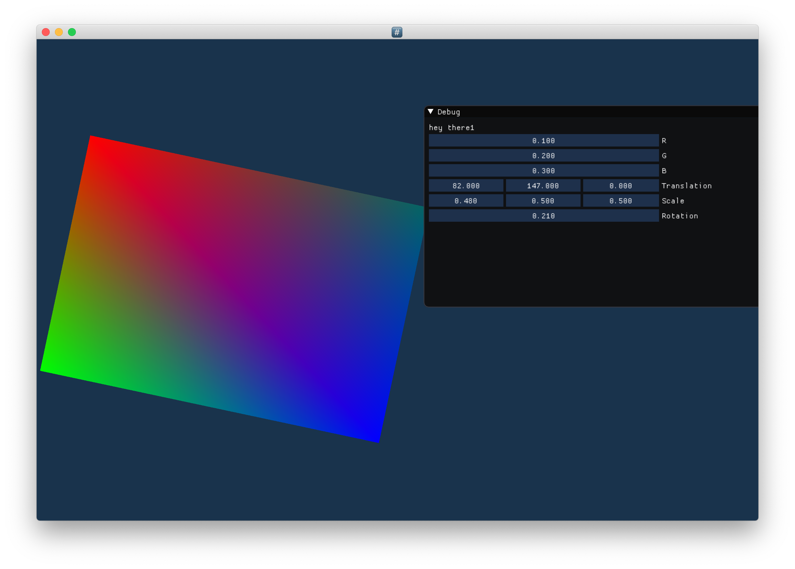

## Pira 🔥

Small experimental library using opengl and rust, lot's of unsafe code =P

### Examples:

#### Instancing:

#### textured quad:

#### ImGui:

#### Particles:

#### Todo's
1. create buffer objects other with data types different then f32's, use a Vec and enums to specify default attribs, like position and color
2. more shader modes.. 
3. use multiple vbo's on vao, instead of one big large buffer ( relates to #1 )
